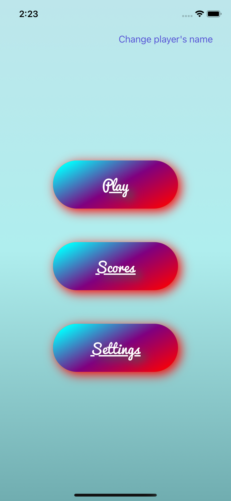
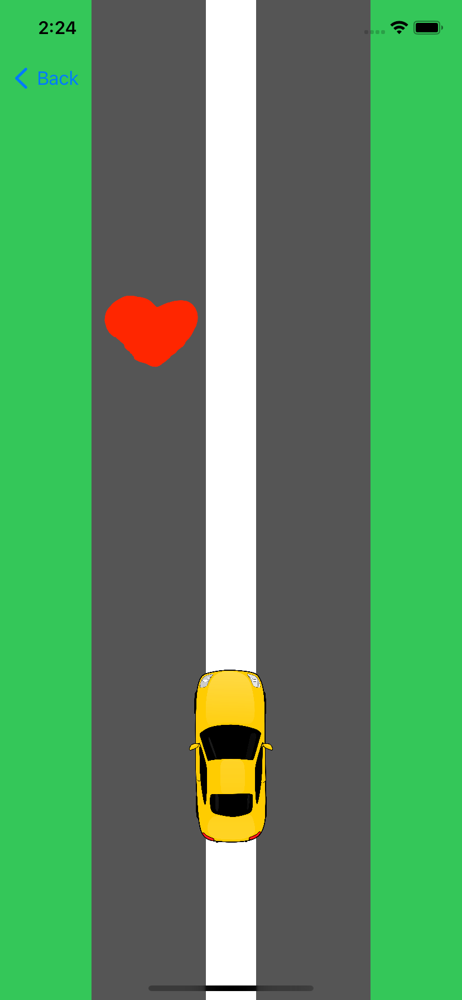
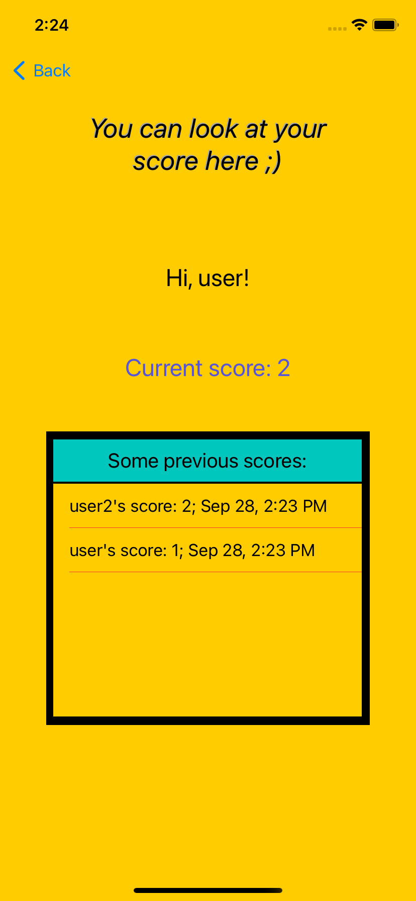
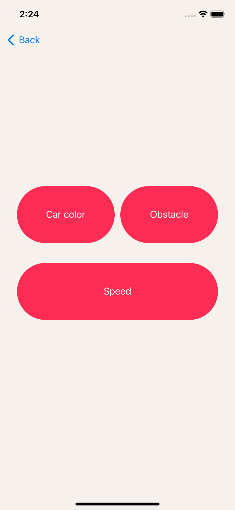
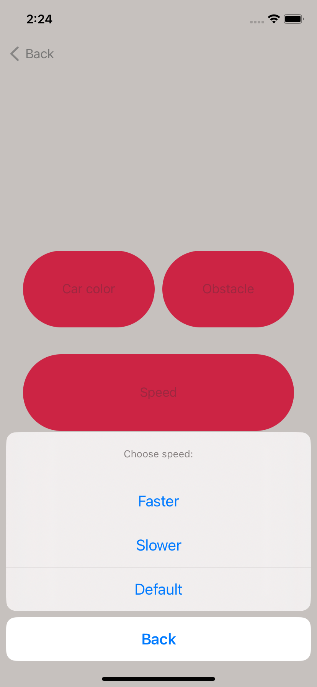

# RaceGame
This is a game where user is not to crash into obstacles.

## Features
User's scores are being saved to a table. 
User can change settings of car color, speed and type of obstacle. 
What is used:
- UIKit
- Firebase

## How to use
1. Clone this repository.
2. cd in terminal
3. Install pods `pod install`
4. Open ~.xcworkspace in Xcode.

## Preview
### Main Screen

### Play Screen

### Scores Screen

### Settings Screen

 

## About
Developer - Paul Hirshtein
App icon - iconarchive
